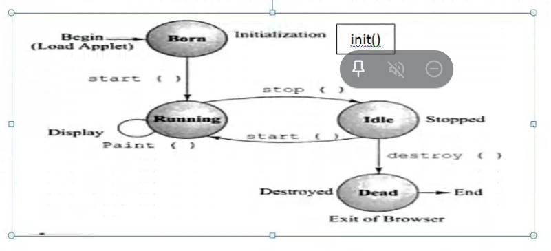

# Applet

From JDK11, Applet viewer has been removed.

Upto Multithrading, all programs done were Application programs, they have `main()`.  
Applet program does not have `main()` method. Applet execution start at `init()`.  
Applet run at client side.  
Applet cannot run independently.  
AWT - Abstract Window Toolkit, for creating UI.  

Applet Lifecycle:

`init()` called only once -> then `start()` -> then `paint()` Called automatically.  
To call `stop()` we need to perform some action, like clicking the minimize button. Then if we restore the window again, `start()` will be called then `paint()`.  
If we click on Close button, then applet calls `destroy()`. `destroy()` is called only once. Before callind `destroy()`, `stop()` is called to free up any resources it holds.